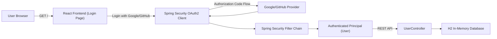
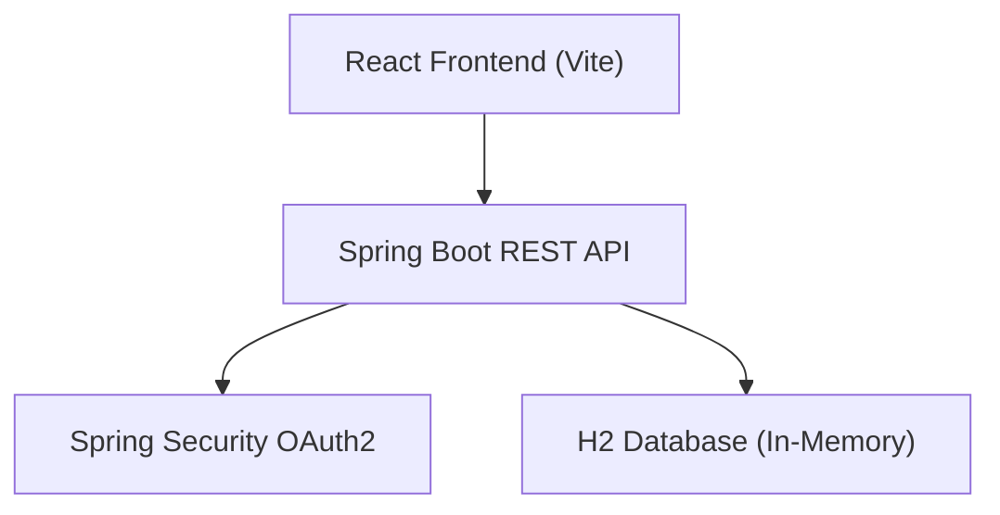

# OAuth2 Integration (Google & GitHub)

A **full-stack web application** that implements secure OAuth2 login using **Google** and **GitHub**.  
Users can sign in securely, view and edit their profile (Display Name and Bio), and log out safely.  

The project is divided into two parts:
- 🧩 **Backend** – Spring Boot 3 (OAuth2 + H2 in-memory DB)
- 💻 **Frontend** – React (Vite) for a modern, responsive UI  
---
## 🚀 Features

### Authentication
- OAuth2 login via **Google** and **GitHub**
- Secure session management with Spring Security
- CSRF protection enabled by default

### User Management
- Authenticated profile page (Display Name, Bio, Avatar, Email)
- Edit and save user details in database
- Automatic redirect and logout flow

### Frontend
- Modern React + Vite app
- Responsive UI for login and profile pages
- Modular component-based structure

---

## 🛠️ Tech Stack

| Layer | Technology |
|-------|-------------|
| **Frontend** | React (Vite, JavaScript ES6+) |
| **Backend** | Spring Boot 3 (Java 17+) |
| **Security** | Spring Security (OAuth2 Client) |
| **Database** | H2 (in-memory) |
| **Build Tools** | Maven (backend), npm (frontend) |

---

## ⚙️ Setup Instructions

### 1️⃣ Clone the Repository
```bash
git clone https://github.com/berna-ahito/oauth2-integration.git
cd oauth2-integration
```

### 🧩 Backend Setup (Spring Boot)
📦 Install Dependencies
```bash
cd backend
mvn clean install
```

### ⚙️ Configure OAuth2 Credentials
Create a .env file (or set Run/Debug configuration in IntelliJ) with your client IDs and secrets:
```bash
GOOGLE_CLIENT_ID=your_google_client_id
GOOGLE_CLIENT_SECRET=your_google_client_secret
GITHUB_CLIENT_ID=your_github_client_id
GITHUB_CLIENT_SECRET=your_github_client_secret
```

### 3️⃣ Run the Backend
```
mvn spring-boot:run
```

Then open your browser and go to:
👉 http://localhost:8080

### 4️⃣ Access the H2 Database (optional)

Go to: http://localhost:8080/h2-console
```
JDBC URL: jdbc:h2:mem:testdb
Username: sa
Password: (leave blank)
```

### 💻 Frontend Setup (React + Vite)
📦 Install Dependencies
```bash
cd ../frontend
npm install
```
### ▶️ Run the Frontend
```bash
npm run dev
```
Access the React app at:
👉 http://localhost:5173

---
## 🌐 Backend Endpoints Summary

| HTTP Method | Endpoint | Description | Authentication Required |
|--------------|-----------|--------------|--------------------------|
| **GET** | `/` | Displays home page with “Login with Google” and “Login with GitHub” buttons | ❌ No |
| **GET** | `/profile` | Displays logged-in user's profile (display name, bio, email, avatar) | ✅ Yes |
| **POST** | `/profile` | Updates user’s display name and bio | ✅ Yes |
| **GET** | `/logout` | Logs out user and redirects to home page with success message | ❌ No |
| **GET** | `/h2-console` | Opens the in-memory H2 database console | ❌ No |

✅ = Requires Login  ❌ = Public Access

**Security & CSRF Protection:**  
This project uses Spring Security’s built-in session-based CSRF protection. All POST forms (Profile and Logout) include a CSRF token automatically provided by Thymeleaf.

**Error Handling:**  
Custom `error.html` and a global `@ControllerAdvice` handler are implemented to catch OAuth2 and generic exceptions gracefully.

## ⏱️ Project Flow
User visits `/` → sees **Login with Google / GitHub**  
After authentication → redirected to `/profile`  
User edits **Display Name** or **Bio** → clicks **Save Changes**  
Changes persist in the **H2 database**  
Clicking **Logout** ends the session and returns to home with a success message  

---

### 🧭 a) OAuth2 Flow

### 🧩 b) Module / Layer Diagram

