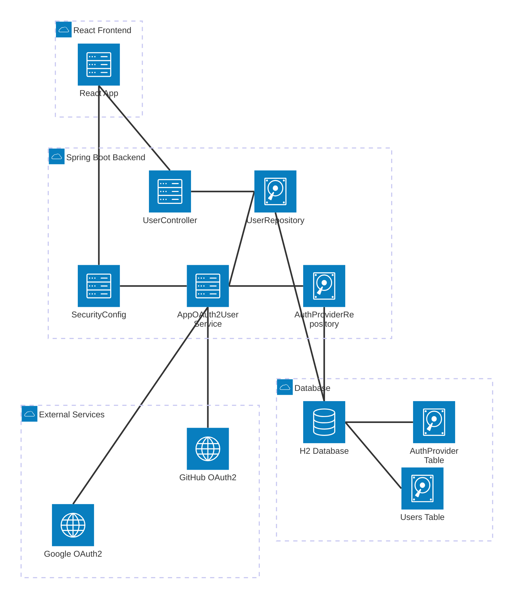

# OAuth2 Integration (Google & GitHub)

A **full-stack web application** that implements secure OAuth2 login using **Google** and **GitHub**.  
Users can sign in securely, view and edit their profile (Display Name and Bio), and log out safely.  

The project is divided into two parts:
- 🧩 **Backend** — Spring Boot 3 (OAuth2 + H2 in-memory DB)
- 💻 **Frontend** — React (Vite) for a modern, responsive UI  

---

## 🚀 Features

### Authentication
- OAuth2 login via **Google** and **GitHub**
- Secure session management with Spring Security
- CORS protection for cross-origin requests
- First successful OAuth2 login creates a local `User` and `AuthProvider` record; subsequent logins map to the same user via provider ID/email

### User Management
- Authenticated profile page (Display Name, Bio, Avatar, Email)
- Edit and save user details in database
- Automatic redirect and logout flow

### Frontend
- Modern React + Vite app
- Responsive UI for login and profile pages
- Modular component-based structure

---

## 🛠️ Tech Stack

| Layer | Technology |
|-------|-------------|
| **Frontend** | React (Vite, JavaScript ES6+) |
| **Backend** | Spring Boot 3 (Java 17+) |
| **Security** | Spring Security (OAuth2 Client) |
| **Database** | H2 (in-memory, for development) |
| **Build Tools** | Maven (backend), npm (frontend) |

---

## 🗄️ Data Model (JPA)

- **User**: `id`, `email`, `displayName`, `avatarUrl`, `bio`, `createdAt`, `updatedAt`  
- **AuthProvider**: `id`, `userId` (→ User), `provider` (`GOOGLE` | `GITHUB`), `providerUserId`, `providerEmail`

Persisted via **Spring Data JPA** to **H2 (in-memory)** for development.

---

## ⚙️ Setup Instructions

### 1️⃣ Clone the Repository
```bash
git clone https://github.com/berna-ahito/oauth2-integration.git
cd oauth2-integration
```

---

### 🧩 Backend Setup (Spring Boot)

#### 📦 Install Dependencies
```bash
cd backend
mvn clean install
```

#### ⚙️ Configure OAuth2 Credentials

**Option 1: Environment Variables (Recommended)**

Set the following environment variables:

**Windows (PowerShell):**
```powershell
$env:GOOGLE_CLIENT_ID="your_google_client_id"
$env:GOOGLE_CLIENT_SECRET="your_google_client_secret"
$env:GITHUB_CLIENT_ID="your_github_client_id"
$env:GITHUB_CLIENT_SECRET="your_github_client_secret"
```

**macOS/Linux:**
```bash
export GOOGLE_CLIENT_ID=your_google_client_id
export GOOGLE_CLIENT_SECRET=your_google_client_secret
export GITHUB_CLIENT_ID=your_github_client_id
export GITHUB_CLIENT_SECRET=your_github_client_secret
```

**Option 2: IntelliJ IDEA**
1. Go to `Run` → `Edit Configurations`
2. Select your Spring Boot application
3. Add environment variables in the `Environment variables` field:
   ```
   GOOGLE_CLIENT_ID=your_google_client_id;GOOGLE_CLIENT_SECRET=your_google_client_secret;GITHUB_CLIENT_ID=your_github_client_id;GITHUB_CLIENT_SECRET=your_github_client_secret
   ```

The `application.properties` file is already configured to use these variables:
```properties
spring.security.oauth2.client.registration.google.client-id=${GOOGLE_CLIENT_ID}
spring.security.oauth2.client.registration.google.client-secret=${GOOGLE_CLIENT_SECRET}
spring.security.oauth2.client.registration.github.client-id=${GITHUB_CLIENT_ID}
spring.security.oauth2.client.registration.github.client-secret=${GITHUB_CLIENT_SECRET}
```

#### 🔑 Obtaining OAuth2 Credentials

**Google OAuth2:**
1. Go to [Google Cloud Console](https://console.cloud.google.com/)
2. Create a new project or select existing one
3. Enable **Google+ API**
4. Go to **Credentials** → **Create Credentials** → **OAuth 2.0 Client ID**
5. Configure consent screen
6. Set **Authorized redirect URIs**: `http://localhost:8080/login/oauth2/code/google`
7. Copy **Client ID** and **Client Secret**

**GitHub OAuth2:**
1. Go to [GitHub Settings](https://github.com/settings/developers)
2. Click **New OAuth App**
3. Fill in:
   - **Application name**: OAuth2 Integration
   - **Homepage URL**: `http://localhost:8080`
   - **Authorization callback URL**: `http://localhost:8080/login/oauth2/code/github`
4. Copy **Client ID** and **Client Secret**

#### 3️⃣ Run the Backend
```bash
mvn spring-boot:run
```

Backend will start at: 👉 **http://localhost:8080**

#### 4️⃣ Access the H2 Database (Optional)

Go to: **http://localhost:8080/h2-console**

```
JDBC URL: jdbc:h2:mem:devdb
Username: sa
Password: (leave blank)
```

---

### 💻 Frontend Setup (React + Vite)

#### 📦 Install Dependencies
```bash
cd ../frontend
npm install
```

#### ▶️ Run the Frontend
```bash
npm run dev
```

Frontend will start at: 👉 **http://localhost:5173**

**CORS Configuration:**  
The backend enables CORS for `http://localhost:5173` so the Vite dev server can communicate with the Spring Boot API during development.

---

## 🌐 API Endpoints

| HTTP Method | Endpoint | Description | Auth Required |
|-------------|----------|-------------|---------------|
| **GET** | `/` | Root endpoint - API status | ❌ No |
| **GET** | `/api/public/ping` | Health check endpoint | ❌ No |
| **GET** | `/api/me` | Get current user info | ✅ Yes |
| **POST** | `/api/profile` | Update user profile (display name, bio) | ✅ Yes |
| **GET** | `/oauth2/authorization/google` | Initiate Google OAuth2 login | ❌ No |
| **GET** | `/oauth2/authorization/github` | Initiate GitHub OAuth2 login | ❌ No |
| **POST** | `/logout` | Log out current user | ✅ Yes |
| **GET** | `/h2-console/**` | H2 database console (dev only) | ❌ No |

✅ = Requires Login&nbsp;&nbsp;&nbsp;&nbsp;❌ = Public Access

---

## 🎯 User Flow

1. User visits **http://localhost:5173** → sees **Login with Google / GitHub** buttons
2. User clicks login button → redirected to OAuth2 provider (Google/GitHub)
3. User authorizes the application
4. OAuth2 provider redirects back to backend with authorization code
5. Backend exchanges code for access token
6. Backend fetches user info from provider
7. `AppOAuth2UserService` creates/updates `User` and `AuthProvider` records
8. User is redirected to `/profile` page
9. User can edit **Display Name** and **Bio** → clicks **Save Changes**
10. Changes persist in the **H2 database**
11. User clicks **Logout** → session ends and returns to home

---

## 🏗️ Architecture Diagram


---

## 🔐 Security Features

- **OAuth2 Authentication**: Industry-standard authentication via Google and GitHub
- **Session Management**: Secure session cookies with Spring Security
- **CORS Protection**: Configured to allow requests only from `http://localhost:5173`
- **CSRF Protection**: Disabled for development (using same-site cookies)
- **Password-less**: No password storage - authentication handled by OAuth2 providers

---

## 📝 Future Enhancements

- [ ] Switch to persistent database (PostgreSQL/MySQL) for production
- [ ] Add email verification
- [ ] Implement role-based access control (RBAC)
- [ ] Add user profile picture upload
- [ ] Support for additional OAuth2 providers (Facebook, Twitter, etc.)
- [ ] Implement refresh token rotation
- [ ] Add comprehensive error handling and logging

---


## ⭐ Show Your Support

Give a ⭐️ if this project helped you!
